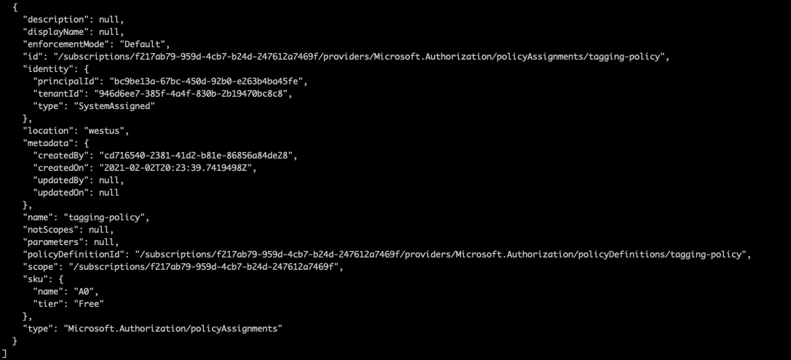
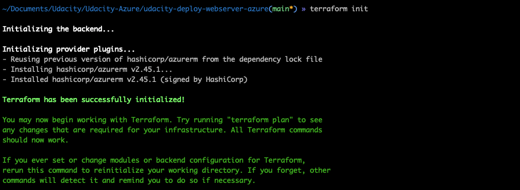
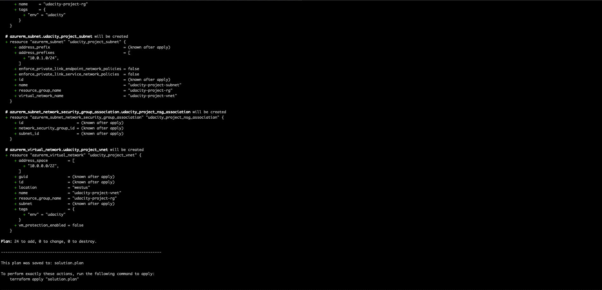
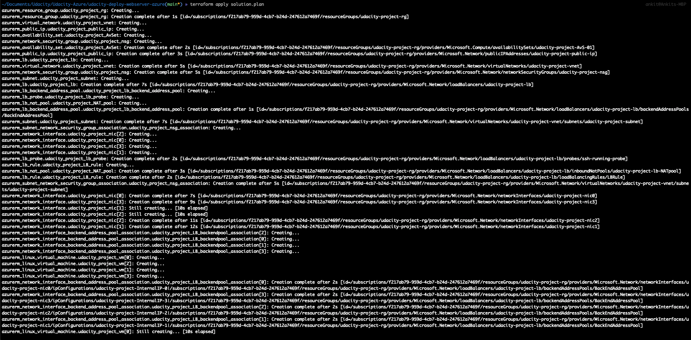
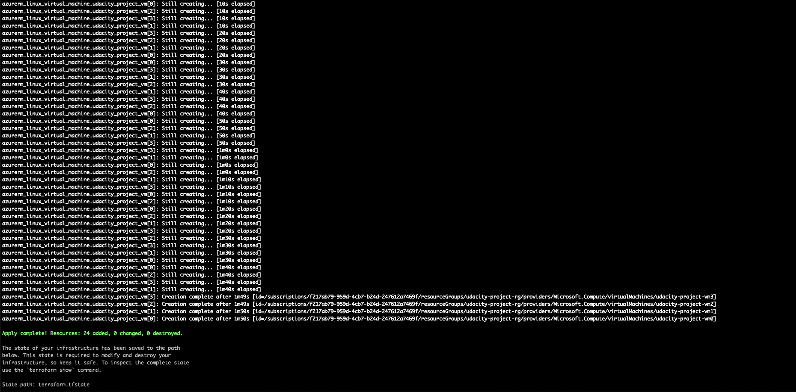
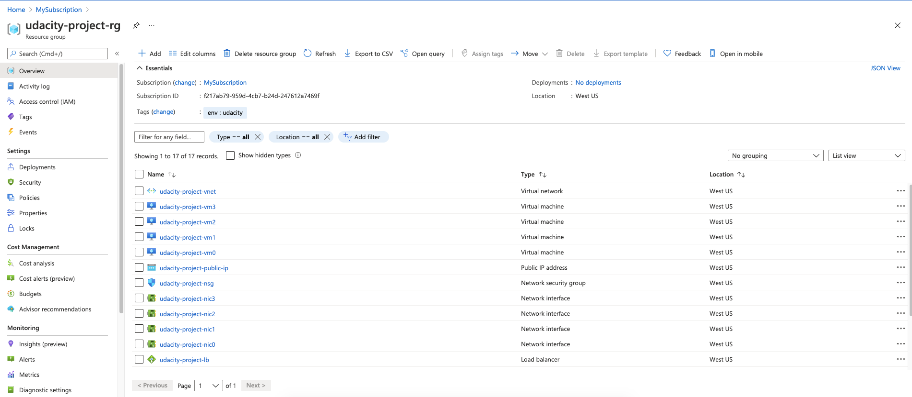
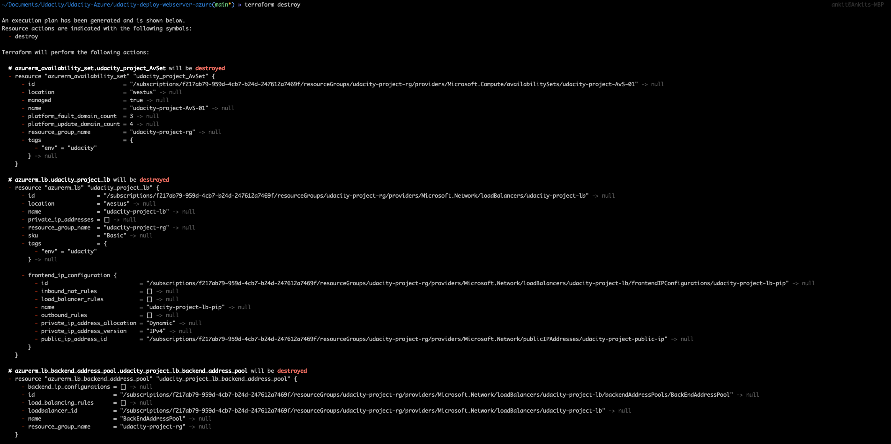
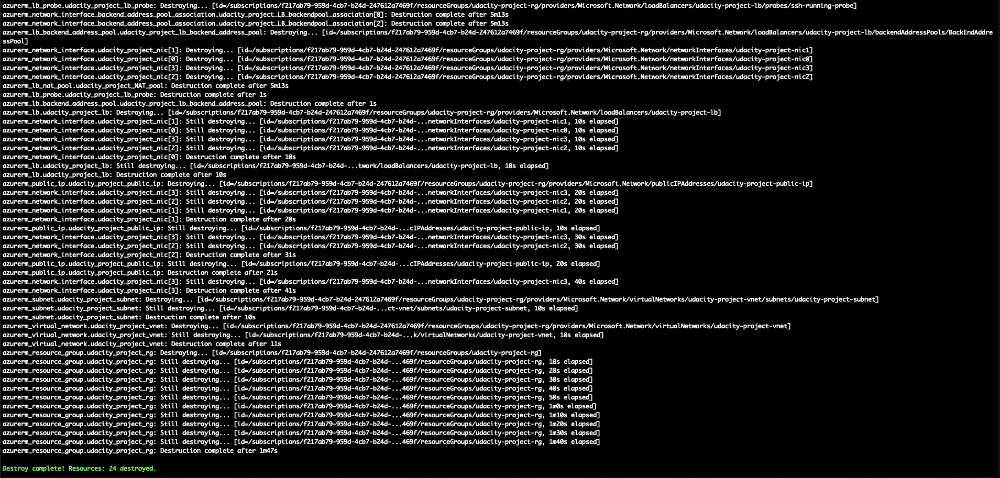

# Azure Infrastructure Operations Project: Deploying a Web Server in Azure

### Introduction

In this project we are deploying a Web Server in Azure using packer and terraform. We are also enforcing Azure policy so that no resource is provisioned without tag.

### Prerequisites

Before we begin ensure the following is complete:

1. Create an [Azure Account](https://portal.azure.com) 
2. Install the [Azure command line interface](https://docs.microsoft.com/en-us/cli/azure/install-azure-cli?view=azure-cli-latest)
3. Install [Packer](https://www.packer.io/downloads)
4. Install [Terraform](https://www.terraform.io/downloads.html)


Below are the steps to deploy webserver in Azure:

### Deploy Azure policy

We can create a policy that ensures all provisioned resources are tagged.

```
az policy definition create --name  tagging-policy  --display-name 'Add a tag to resources' --description 'Prevents the creation of any resource missing a tag.' --subscription "MySubscription" \
    --mode Indexed --rules "{ \"if\": { \"field\": \"tags\", \"exists\": \"false\" }, \
        \"then\": { \"effect\": \"deny\" } }"
```

```
az policy assignment create --name tagging-policy --policy tagging-policy --assign-identity --identity-scope /subscriptions/f217ab79-959d-4cb7-b24d-247612a7469f --location westus
```

Check the policy by running `az policy assignment list`



### Build Packer image

1. Create a resource group with az group create: `az group create -l westus -n packer-rg`

```
{
  "id": "/subscriptions/f217ab79-959d-4cb7-b24d-247612a7469f/resourceGroups/packer-rg",
  "location": "westus",
  "managedBy": null,
  "name": "packer-rg",
  "properties": {
    "provisioningState": "Succeeded"
  },
  "tags": null,
  "type": "Microsoft.Resources/resourceGroups"
}
```

2. Create a service principal with az ad sp create-for-rbac and output the credentials that Packer needs:

```
az ad sp create-for-rbac --query "{ client_id: appId, client_secret: password, tenant_id: tenant }"
az account show --query "{ subscription_id: id }"
```

```
export ARM_SUBSCRIPTION_ID=your_subscription_id
export ARM_CLIENT_ID=your_appId
export ARM_CLIENT_SECRET=your_password
export ARM_TENANT_ID=your_tenant_id
```

3. Build Image

`packer build server.json`

### Deploy the infrastructure

1. Initialise the Terraform environment inside the cloned repo.

`terrafrom init`



2. Run the following terraform commands to deploy the infrastructure to Azure.

**Note:** You could either store the variable values in `.tfvars` file or can pass in using `-var` parameter to the plan command. In this project, I have added default values for each variable in `variable.tf` so if not passed it won't prompt for an input. 

`terraform plan -out solution.plan`




`terraform apply solution.plan`





Once the `terraform apply` is successfully run, you would see all the project resources created in the azure portal.




### Clean up the environment

`terraform destroy`



